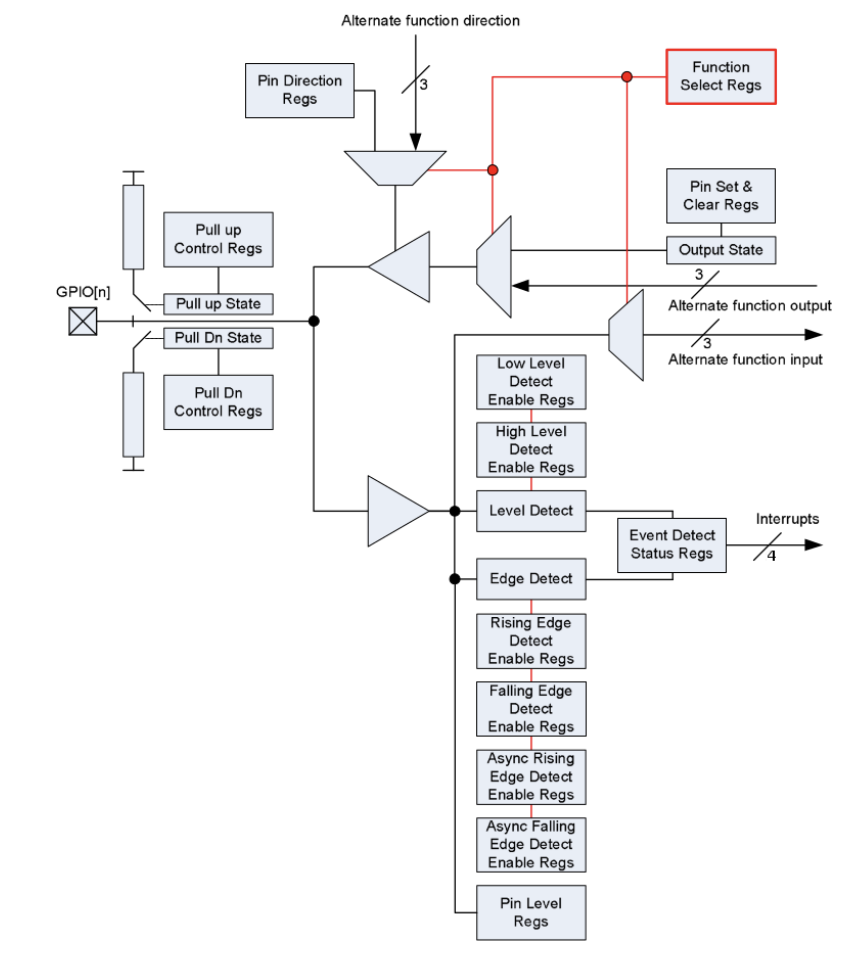

# Phase 1: UART Driver

### What is UART?
* UART = Universal Asynchronous Receiver/Transmitter
* UART is for debugging the OS
    * connects Pi to Mac
    * prints debug messages to terminal 
    * allows visibility into what OS is doing
* protocol for sending/receiving data one byte at a time over two wires
    * TX (transmit) &rarr; send data from Pi to MAC
    * RX (receive) &rarr; receive dat from Pi to MAC
* for Pi 4: UART0 is main serial port, TX on GPIO 14 (pin 8), RX on GPIO 15 (pin 10), baud rate is 115200 bits/second
    * baud rate is the speed of communication, how many bits per second you ucan send over the wire
    * example:  
        Send the character 'H' which is `01001000` in binary (8 bits)
        at $115200$ baud  
        each bit takes $1/115200=0.0000087$ seconds  
        the whole byte takes $8*(1/115200) = 0.000069$ seconds
```
Pi 4 boots
    ↓
Bootloader initializese CPU
    ↓
Kernel calls main()
    ↓
main() does stuff
    ↓
Pi 4 UART Controller
    ↓
    Sends bytes to TX wire
    ↓
USB-to-UART adapter
    ↓
Your Mac serial console
    ↓
"Hello from ARM!"
```

### How does memory-mapped I/O work?
* hardware devices (UART, GPIO) controlled by registers
* example:
    ```
    uint32_t *uart_data = (uint32_t *)0x3F201000;
        // declare a pointer: uart_data is a pointer to a 32 bit unsigned integer
        // *uart_data is a pointer that stores the memory address 0x3F201000, address is cased to a pointer to a 32 bit unsigned int (so the address isn't just a number)
        // uart_data is a pointer that points to memory address 0x3F201000
    *uart_data = 'H'; // send the character 'H' to UART
        // dereference (*) the pointer and write 'H' to the memory address
    ```
* GPIO controller base: `0x3F200000`
* UART0 controller base: `0x3F201000`
* hardware devices (peripherals like UART, GPIO, Timer, Bluetooth, USB, etc) are accessed through memory addresses, each is a separte chip/circuit inside or attached to the Pi
    * CPU tells peripheral to turn pins to HIGH/LOW using memory-mapped I/O by writing to specific memory addresses
    * memory-mapped because peripherals are "mapped" into address space at `0x3F000000-0x3F010000`

### UART
* UART driver structure
    ```
    uart.h (header file)
    |-- uart_init()
    |-- uart_putc(char) --> put char
    |-- uart_puts(const char *s) --> put string
    |-- uart_getc() [optional for input]

    uart.c (implementation)
    |-- register definitions (addresses)
    |-- uart_init() implementation
    |-- uart_putc() implementation
    |-- uart_puts() implementation
    ```
* kernel.c calls uart_iit() at tartup, uses uart_puts() for all kernel related outputs
* BCM2711 ARM Peripherals Datasheet
    * GPIO
        * TL;DR --> physical GPIO pins (GPIO#, 0-53) are controlled by a GPFSEL register by an assigned 3 bit range
            * Physical GPIO Pins
                * just wires until you tell them what to do
            * GPFSEL register
                * configure each pin (using 3 bit code) to tell bit what to do (input, output, alternate function)
            * GPSET/CPCLR
                * drive pin HIGH or LOW 
            * GPLEV
                * read voltage on pin
        * 
            * this diagram shows how a single GPIO pin works and how software can control a pin/what features are available
            * what can a pin do:
                * be an input (read voltage from external circuit)
                * be an output (drive voltage to external circuit)
                * use alternate functions
                * generate interrupts by notifying CPU when pin state changes
                * have pull-up/pull-down resisters
                * detect edges or levels
            * LEFT (pull-up/pull-down control)
                * when a GPIO pin is configured as input it is floating (undefined voltage) if nothing is connected. Pull-up resistor connects pin to 3.3V through a resistor if nothing drives then the pin reads HIGH. Pull-down resister connects the pin to GND (ground) through a resistor if nothing drives then the pin reads LOW.
                * This is controlled using registers
                    ```
                    PULL_UP_ENABLE = 1    // Pull pin toward 3.3V
                    PULL_UP_ENABLE = 0    // No pull-up
                    PULL_DN_ENABLE = 1    // Pull pin toward GND
                    PULL_DN_ENABLE = 0    // No pull-down
                    ```
            * TOP (Pin Direction Register)
                * direction register tells the pin if it is an input or output
                    ```
                    DIRECTION = 0 // Input
                    DIRECTION = 1 // Output
                    ```
            * TOP RIGHT, red lines (function selection registers)
                * pins can be GPIO mode (controlled by GPIO output register and pin direction) or alternate function mode (connected to something else like UART, SPI, I2C, etc)
                    ```
                    FUNCTION_SELECT = 0 // GPIO mode
                    FUNCTION_SELECT = 4 // alternate function 0
                    FUNCTION SELECT = 5 // alternate function 1
                    ``` 
            * CENTER RIGHT (output control)
                * write to output registers to control the pin voltage
                    ```
                    OUTPUT_SET = 1 // drive pin HIGH (3.3V)
                    OUTPUT_CLEAR = 1 // drive pin LOW (0V)
                * if alternate function used, the alternate hardware controls output signal (for example, UART)
            * CENTER LEFT (input path)
                * if the pin is set to be input or alternate function input voltage on pin is read to determine if pin is HIGH or LOW
            * BOTTOM (detection logic)
                * level detection
                    * is the pin currently HIGH or LOW (continuous, synchronous to clock)
                    ``` 
                    LEVEL_DETECT = HIGH // interrupt CPU if pin is HIGH
                    LEVEL_DETECT = LOW // interrupt CPU if pin is LOW
                    ```
                * edge detection
                    * rising edge means pin transitioned from LOW to HIGH
                    * falling edge means pin transitioned from HIGH to LOW
                    ```
                    RISING_EDGE_ENABLE = 1 // interrupt CPU on rising edge
                    FALLING_EDGE_ENABLE = 1 // interrupt CPU on falling edge
                    ```
                * async detection
                    * async detection is faster than regular edge detection because it doesn't wait for clock, use for fast response
            * RIGHT (interrupts)
                * when a detected event (from the bottom) occurs an interrupt flag is set
                * CPU interrupt handler reads this flag and then clears the flag
                ```
                if (RISING_EDGE_DETECTED == 1) {
                    // interrupt
                    RISING_EDGE_DETECTED = 0; // clear flag
                }
                ```
        * GPIO 14 and 15 are set for UART (GPFSEL = GPIO Function Select)
            ```
            GPFSEL1[14:12] = 1 // GPIO 14, alternate function (UART TX, transmit)
            GPFSEL1[17:15] = 1 // GPIO 15, alternate function (UART RX, receive)
            ```
            * GPIO 14 automatically outputs UART TX signal
            * GPIO 15 automatically reads UART RX signal
            * UART hardware takes over (control output state and input value)
        
        * GPIO base address for this project is `0x3F200000` 
        * GPIO controller manages all 54 GPIO pins (GPIO 0-53)
            | Register | Offset | Controls|
            | :--- | :---: | ---: |
            | GPFSEL0 | 0x00 | GPIO 0-9 (3 bits each) |
            | GPFSEL1 | 0x04 | GPIO 10-19 (3 bits each) | 
            | GPFSEL2 | 0x08 | GPIO 20-29 (3 bits each) |
            | GPFSEL3 | 0x0C | GPIO 30-39 (3 bits each) |
            | GPFSEL4 | 0x10 | GPIO 40-49 (3 bits each) |
            | GPFSEL5 | 0x14 | GPIO 50-53 (3 bits each) |
            * each GPIO pin uses 3 bits in its GPFSEL register
            ```
            000 = GPIO input
            001 = GPIO output
            100 = Alternate function 0 (ALT0)
            101 = Alternate function 1 (ALT1)
            110 = Alternate function 2 (ALT2)
            111 = Alternate function 3 (ALT3)
            010 = Alternate function 4 (ALT5)
            ```
            * EXAMPLE: GPIO 14 is controlled by bits [14:12] of GPFSEL1, `GPFSEL1[14:12] = 100 (bin) = 4 (dec) = ALT0 (UART TX)`
            * for a 32 bit register:
                ```
                GPFSEL1 controls GPIO 10-19:
                Bits [2:0]   = GPIO 10 function
                Bits [5:3]   = GPIO 11 function
                Bits [8:6]   = GPIO 12 function
                Bits [11:9]  = GPIO 13 function
                Bits [14:12] = GPIO 14 function  ← This one
                Bits [17:15] = GPIO 15 function  ← And this one
                Bits [20:18] = GPIO 16 function
                Bits [23:21] = GPIO 17 function
                Bits [26:24] = GPIO 18 function
                Bits [29:27] = GPIO 19 function
                ```
            * to do this create a pointer to GPFSEL1 register and edit current value using bit arithmetic (read current value, clear bits to write to, set bits to write to), write back to register
            * To set register output use `GPSET`, to clear register output use `GPCLR`, to read register state use `GPLEV`, to check for event status use `GPEDS`, to check for rising edge `GPREN`, to check for falling edge use `GPFEN`
                * GPSET/CLR/LEV/EDS/REN/FEN0 is for GPIO 0-31
                * GPSET/CLR/LEV/EDS/REN/FEN1 is for GPIO 32-53
            * for async edge detection use `GPAREN`, faster because it doesn't wait for clock synchronization but it is less stable (good for fast responses liek button presses)
                ```
                GPAREN0     0x7C    Async rising edge on GPIO 0-31
                GPAREN1     0x80    Async rising edge on GPIO 32-53
                GPAFEN0     0x88    Async falling edge on GPIO 0-31
                GPAFEN1     0x8C    Async falling edge on GPIO 32-53
                ```
            * GPIO Pull-Up/Pull-Down Control Registers
                ```
                GPIO_PUP_PDN_CNTRL_REG0     0xE4    GPIO 0-15 pull-up/pull-down
                GPIO_PUP_PDN_CNTRL_REG1     0xE8    GPIO 16-31 pull-up/pull-down
                GPIO_PUP_PDN_CNTRL_REG2     0xEC    GPIO 32-47 pull-up/pull-down
                GPIO_PUP_PDN_CNTRL_REG3     0xF0    GPIO 48-53 pull-up/pull-down
                ```
                * each GPIO uses 2 bits (00 = No pull, 01 = Pull down, 10 = Pull up, 11 = Reserved)
                * pull up resistor connects the pin to 3.3V through a resistor
                * pull down resistor connects the pin to GND 0.0V through a resistor
                * only needed for floating

    * UART Initialization Sequence
        * Disable GPIO Pull-Up/Pull-Down on UART Pins (GPIO 14/15)
            * read GPIO_PUP_PDN_CNTRL_REG1 (0x3F2000E8)
                * for GPIO 14: bits [29:28]
                * for GPIO 15: bits [31:30]
                * set to 00 (no pull up/down)
            * write back
        * configure GPIO 14/15 Alternate Function
            * GPIO 14/15 pins are controlled by GPFSEL1 register
            * read GPFSEL1 (address 0x3F200004)
                * GPIO 14 on bits [14:12]
                * GPIO 15 on bits [17:15]
            * clear bits [14:12] and [17:15]
            * set bits to 100 (binary) which is 4 (decimal) or ALT0
                * GPIO 14: ALT0 (UART0 TX) and ALT5 (UART1 TX)
                * GPIO 15: ALT0 (UART0 RX) and ALT5 (UART1 RX)
        * UART hardware now controls GPIO 14and 15

    * UART Registers
        * UART_BASE = 0x3F201000
            ```
            UARTDR   (0x3F201000 + 0x00)  = Data Register
            UARTFR   (0x3F201000 + 0x18)  = Flag Register
            UARTIBRD (0x3F201000 + 0x24)  = Integer Baud Rate Divisor
            UARTFBRD (0x3F201000 + 0x28)  = Fractional Baud Rate Divisor
            UARTLCR_H (0x3F201000 + 0x2C) = Line Control Register
            UARTICR  (0x3F201000 + 0x30)  = Control Register
            UARTIMSC (0x3F201000 + 0x38)  = Interrupt Mask Register
            ```
        * UARTDR (Data Register): send (write) and receive (read) byte over UART
        * UARTFR (Flag Register): bit 6 is TXFE (transmit FIFO empty) which is checked before sending and bit 5 is FXFF (receive FIFO full) which is checked before receiving. There is also a status flag
        * UARTIBRD & UARTFBRD (Baud Rate): sets the transmission rate (bits per second). For 115200 baud IBRD=26 and FBRD=3. IBRD=Integer part and FBRD=Fractional part
            * `Baud Rate = Clock Frequency / (16 * Divisor)`
            * Example:
                ```
                For 115200 baud on Pi 4
                Clock frequency 48 MHz = 48000000 Hz --> desired baud rate: 115200 bps

                Formula:
                Divisor = Clock Frequency / (16 * Baud Rate)
                Divisor = 48000000 / (16 * 115200)
                Divisor = 26.0434

                IBRD = 26
                FBRD = 0.0434 * 64 = 2.78 ≈ 3
                ```
        * UARTLCR_H (Line Control): Bits [6:5] determine word length (up to 11=8 bits), bit 4 enables FIFO, bit 3 is stop bits, bit 1 is parity. Line Control is how to send
            * Example: Send 8-bit characters with 1 stop bit, no parity, FIFO enabled
                ```
                01110000
                ││││││└─ BRK = 0 (don't send break)
                │││││├─ PEN = 0 (no parity)
                ││││├── EPS = 0 (even parity, doesn't matter)
                │││├─── STP2 = 0 (1 stop bit)
                ││├──── FEN = 1 (FIFO enabled)
                ├─ WLEN = 11 (8-bit words)
                └─ SPS = 0 (stick parity, doesn't matter)
                ```
        * UARTICR (Control): Bit 0 is UART enable, bit 8 is TX enable, bit 9 is RX enable, Control is whether to send (is UART on or off)
        * UARTIMSC (Interrupt Mask): 0 to disable interrupts, 1 to enable

### What registers need to be configured
* To implement UART
    1. configure GPIO 14 and GPIO 15 as UART pins: in GPIO mode they are general-purpose input/output but can be configured for alternate functions (Alternate Function 0 for UART mode)
    2. configure the UART controller: set baud rate to 115200 bps, word size to 8 bits, enable UART transmit
    3. baud rate calculation: values for IBRD and FBRD for 115200 baud at 48MHz clock (CM2711 ARM Peripherals PDF, ARM PL011 UART Technical Reference)